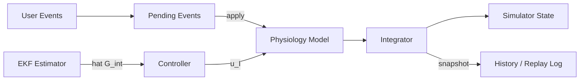

# Digital Twin Model Summary

## 1. Executive summary

This document describes the V1 low-order physiological model used by
the project to simulate glucose–insulin dynamics for CGM replay,
validation, and conservative short-horizon prediction. The model is a
compact, explainable grey-box system composed of five continuous
compartments (plasma glucose, plasma insulin, subcutaneous insulin
depot, stomach carb pool, intestinal carb pool) and an interstitial
sensor state used by the controller and estimator.

The implementation executes continuous ODE propagation inside a
sampled-data loop (logical step width `dt_minutes`) and applies
post-step safety clamps. The integrator is `scipy.integrate.solve_ivp`.

## 2. Purpose and design principles

- Reproducible CGM replay for validation against benchmark windows.
- Conservative, explainable what‑if predictions (short horizon).
- Deterministic loop order to simplify reproducibility and testing.
- Small number of interpretable parameters to enable rapid tuning.

Design trade-offs: fidelity is intentionally limited to preserve
robustness, interpretability, and safe conservative behavior.

## 3. Notation and system overview

State vector (continuous states):

$$
\mathbf{x}(t) = \begin{bmatrix}
G(t) \\
I(t) \\
I_{\mathrm{subq}}(t) \\
C_{s}(t) \\
C_{i}(t) \\
G_{\mathrm{int}}(t)
\end{bmatrix}
\;=\; [G, I, I_{\mathrm{subq}}, C_{s}, C_{i}, G_{\mathrm{int}}]^T
$$

Inputs (sampled/discrete):
- $u_I$: commanded insulin infusion rate (from controller),
- $u_{\mathrm{basal}}$: persistent basal pump rate,
- meals/boluses applied as instantaneous additions to $C_s$ or
  $I_{\mathrm{subq}}$ respectively.

Measured output used by controller/estimator:
- $y(t) = G_{\mathrm{int}}(t)$ (interstitial glucose / CGM proxy)

Compact system form:

$$
\dot{\mathbf{x}} = f(\mathbf{x}, u; p),\qquad y = h(\mathbf{x}; p)
$$

where $p$ denotes the (mostly constant) `ModelConfig` parameters.

## 3.1 System variables (inputs, outputs, states, parameters, disturbances)

This subsection groups the model's signals and parameters into the
canonical control-theory categories so readers can quickly map symbols
in the equations to runtime names in the codebase.

- Inputs `u` (controllable inputs applied to the model):
  - `u_I`: commanded insulin infusion rate (controller output).
  - `u_{basal}`: persistent basal pump rate (stored as per-minute
    input in the simulator).
  - Meal events / boluses (treated as input events): carbohydrate
    additions applied to the stomach pool `C_s` and bolus insulin
    added to the subcutaneous depot `I_{subq}`.

- Outputs `y` (measured quantities / observations):
  - `y(t) = G_{int}(t)` — interstitial glucose (CGM proxy) used by the
    estimator and controller.

- States `x` (minimal information needed to predict future behaviour):
  The continuous states used in the model equations are:
  - `G` — plasma glucose (mmol/L)
  - `I` — plasma insulin (mU/L)
  - `I_{subq}` — subcutaneous insulin depot (mU)
  - `C_s` — stomach carbohydrate pool (g)
  - `C_i` — intestinal carbohydrate pool (g)
  - `G_{int}` — interstitial (CGM) glucose (mmol/L)

  Note: the simulator's `SimulationState` contains additional bookkeeping
  fields (insulin rate, subcutaneous absorption state, basal rate,
  timestamps) that are part of the runtime state but not independent
  ODE variables in the compact model form above.

- Parameters `p` (time‑scale / structural constants that change only
  slowly or via tuning):
  These appear in the equations as gains, time constants, mapping
  factors and safety bounds. Representative parameter names (see
  `src/core/state.py` for authoritative defaults) include:
  - `glucose_decay` ($k_g$), `insulin_decay` ($k_i$),
    `insulin_sensitivity` ($S_I$), `insulin_response_gain` ($k_r$)
  - `carb_to_glucose_gain` ($k_c$)
  - `stomach_tau_minutes` ($\tau_s$), `intestine_tau_minutes` ($\tau_i$),
    `interstitium_tau_minutes` ($\tau_{int}$)
  - `insulin_subq_absorption_tau_minutes` ($\tau_{subq}$),
    `insulin_subq_fraction`
  - `plasma_volume_ml` (unit conversion), `dt_minutes` (simulation step)
  - safety clamps: `min_glucose`, `max_glucose`, `min_insulin`,
    `max_insulin`

- Disturbances `w` (uncontrolled or unmeasured inputs):
  - Measurement noise on the CGM (`measurement_noise_variance`).
  - Unrecorded meals or snack events, unmodeled exercise/sport
    (which can transiently change insulin sensitivity), stress,
    or other physiological disturbances.

General notes:
- State definition: a correct `x(t)` contains all past information
  needed to predict future output given future inputs; here the six
  continuous states above form that sufficient summary for the low‑order
  model.
- Measurable vs latent: only `G_{int}` is treated as measured in this
  project; plasma glucose `G` is latent and inferred by the estimator.
- Time-scale and model type: this model operates on a minute-scale
  sampling (`dt_minutes`), and is a hybrid of continuous ODE dynamics
  integrated inside a sampled-data loop (continuous dynamics, discrete
  step updates and events).

Example (different domain) — mapping for intuition:
- Input: Heat inflow `Q`  → Input `u`
- Output: Measured temperature `T` → Output `y`
- Parameter: Specific heat `c` → Parameter `p`
- State: Temperature `T` → State `x`
- Disturbance: Ambient temperature `T_a` → Disturbance `w`

## 4. Core equations (continuous dynamics)

Plasma glucose $G$ (mmol/L):

$$
\frac{dG}{dt} = -k_{g}\,(G-G_b) - S_I\,[I - I_b]_{+} + k_{c}\,C_{i}
$$

Plasma insulin $I$ (mU/L):

$$
\frac{dI}{dt} = -k_{i}\,(I - I_b) + k_{r}\,[G - G_b]_{+} + u_I + u_{\mathrm{basal}}
 + \frac{1}{\tau_{\mathrm{subq}}}I_{\mathrm{subq}}
$$

Subcutaneous depot $I_{\mathrm{subq}}$ (mU):

$$
\frac{dI_{\mathrm{subq}}}{dt} = -\frac{1}{\tau_{\mathrm{subq}}}I_{\mathrm{subq}}
$$

Stomach carb pool $C_{s}$ (g):

$$
\frac{dC_s}{dt} = -\frac{1}{\tau_s}C_s
$$

Intestinal carb pool $C_{i}$ (g):

$$
\frac{dC_i}{dt} = \frac{1}{\tau_s}C_s - \frac{1}{\tau_i}C_i
$$

Interstitial (CGM proxy) $G_{\mathrm{int}}$ (mmol/L):

$$
\frac{dG_{\mathrm{int}}}{dt} = \frac{G - G_{\mathrm{int}}}{\tau_{\mathrm{int}}}
$$

Notation: $[\cdot]_+ = \max(0,\cdot)$. Parameters are described in
Section 6.

After each logical step the simulator applies safety projections:

$$
G \leftarrow \operatorname{clamp}(G, G_{\min}, G_{\max}),\qquad
I \leftarrow \operatorname{clamp}(I, I_{\min}, I_{\max}),\qquad
C_s, C_i \leftarrow \max(0, \cdot)
$$

## 5. Controller (Proportional, conservative)

The V1 controller computes an insulin-rate command from the corrected
interstitial estimate $\hat G_{\mathrm{int}}$ (estimator output) using
a proportional law with deadband and rate/clamping limits:

$$
e = \hat G_{\mathrm{int}} - G_{\mathrm{target}}
$$

$$
u_I^{\star} = K_p\,\max(0, e - \Delta_{\mathrm{dead}})
$$

The final commanded rate $u_I$ is obtained by applying lower/upper
bounds and a maximum change-per-minute constraint (rate limiter) to
ensure safety. The GUI and `ControllerConfig` contain these tuning
parameters.

## 6. Estimation (EKF scaffold)

An Extended-Kalman-Filter-like scaffold is used to (optionally)
correct the interstitial estimate before the controller sees it. The
EKF is intentionally lightweight: finite-difference process Jacobians
and a simple measurement model $y=G_{\mathrm{int}}$ are used. The
estimator is tuned conservatively so it does not overfit noisy CGM
timestamps during replay.

Key estimator roles:
- Provide a smoothed/corrected interstitial value for the controller.
- Support replay mode where measurements are ingested as corrections.
- Produce diagnostic residuals used in validation metrics.

## 7. Units and simulator boundary conversions

- CGM / glucose: stored/displayed in mmol/L (code supports mg/dL
  conversion for I/O).
- Insulin units: simulator converts pump `U/h` or bolus units into
  internal concentration using `plasma_volume_ml`.
- Conversion example: internal micro-units per mL conversion is

$$
\mathrm{uU/mL} = \frac{\mathrm{units}\times 10^6}{\mathrm{plasma\_volume\_ml}}
$$

Boluses are added to $I_{\mathrm{subq}}$; basal rates are stored as
per-minute persistent inputs applied each step.

## 8. Parameters and tuned default values

The model exposes a compact set of tunable parameters. The following
are the tuned defaults currently used by the code (see
`src/core/state.py` for the authoritative definitions). These values
are intentionally conservative and intended for replay/validation and
safe short-horizon prediction.

ModelConfig (physiology and safety)
- `dt_minutes`: 1.0
- `plasma_volume_ml`: 12000.0
- `glucose_basal`: 5.0 (mmol/L default baseline; often seeded from data)
- `insulin_basal`: 0.0 (mU/L baseline)
- `glucose_decay`: 0.015
- `insulin_decay`: 0.1
- `insulin_sensitivity`: 0.0006
- `insulin_response_gain`: 0.32
- `stomach_tau_minutes`: 18.0
- `intestine_tau_minutes`: 40.0
- `carb_to_glucose_gain`: 0.0015
- `interstitium_tau_minutes`: 8.0
- `insulin_subq_fraction`: 1.0
- `insulin_subq_absorption_tau_minutes`: 30.0
- `min_glucose`: 1.0 (mmol/L)
- `max_glucose`: 20.0 (mmol/L)
- `min_insulin`: 0.0
- `max_insulin`: 300.0

ControllerConfig (automation safety & tuning)
- `target_glucose` (target): 5.5 mmol/L
- `proportional_gain` (K_p): 0.5
- `deadband`: 0.15 mmol/L
- `max_insulin_rate`: 2.0 (units/min equivalent in simulator units)
- `max_rate_delta_per_step`: 0.15

EstimatorConfig (EKF scaffold defaults)
- `initial_covariance`: 1.0
- `process_noise_scale`: 0.02
- `insulin_process_noise`: None (defaults to process_noise_scale)
- `measurement_noise_variance`: 0.09
- `finite_difference_step`: 1e-4
- `minimum_covariance`: 1e-6

IntegratorConfig (ODE solver defaults)
- `method`: RK45
- `rtol`: 1e-6
- `atol`: 1e-8
- `max_step`: None
- `dense_output`: False

Automatic profile detection (pump / MDI / healthy) in the GUI adjusts a
very small subset of defaults (e.g. `insulin_basal`,
`insulin_response_gain`) at window preload time to provide better initial
behaviour for replay; those mappings remain documented in the code and
are intentionally pragmatic rather than personalization steps.

## 9. System decomposition and data flow

## 10. Limitations and clarification

- Not a clinical-grade model: parameters are not patient‑specific and
  should not be used for treatment decisions.
- Two-compartment meal model and linear insulin action are simplifications
  chosen for interpretability.
- EKF implementation is a scaffold — it improves replay fit but is not a
  full personalization algorithm.
- Event timing is quantized to the simulator step; sub-step timing is
  not modelled.

## 11. Developer notes and extension points

- `ModelConfig` exposes parameters for calibration and unit mapping.
- To add personalization, replace or extend the estimator and provide
  a parameter identification routine that updates `ModelConfig`.
- To increase physiological fidelity, introduce additional insulin
  compartments or a nonlinear insulin action term, but preserve the
  conservative controller safety layers.

---

Last updated: 2026-05-16
