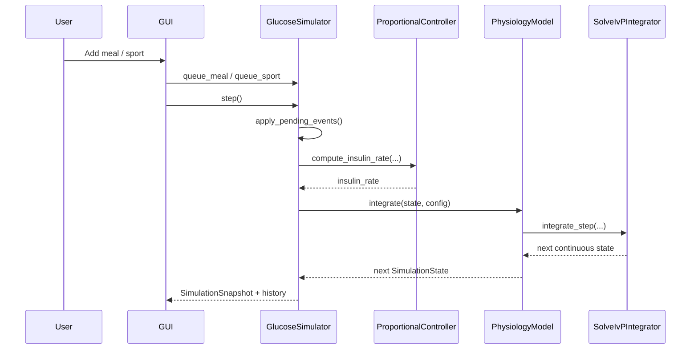
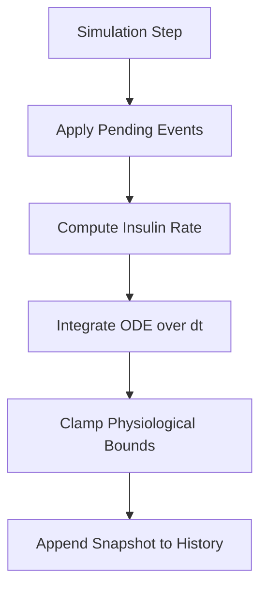

# Digital Twin Simulation Summary

## 1. Purpose of the Simulation Model
The simulation coordinates user disturbances, control decisions, and
physiology integration in a deterministic step loop. It provides a
reproducible runtime for studying glucose-insulin behavior and control
responses under meal and sport events.

Primary goals:
- Execute a deterministic update pipeline every step
- Provide live state/history for visualization
- Support interactive what-if scenarios through GUI controls

## 2. Expected Results and Use of Results
Expected outputs:
- Time traces of glucose, insulin, and insulin infusion rate
- Observable response to meals (glucose rise) and sport (increased
  sensitivity)
- Automated controller compensation after disturbances

Typical use:
- Demonstration of closed-loop behavior
- Parameter tuning and qualitative sensitivity exploration
- Regression testing of control and model behavior

## 3. Exactness
- Numerical exactness: governed by `solve_ivp` method/tolerances from
  `IntegratorConfig`
- Model exactness: low-order approximation; suitable for education and
  engineering iteration, not medical diagnosis
- Determinism: high, given same initial conditions, events, and
  configuration

## 4. Time Requirements
- Current mode: near real-time stepping (GUI schedules repeated calls)
- Supports conceptual fast-forward by invoking multiple steps quickly
- Slow-motion is possible by increasing UI update interval externally
- Not implemented yet: explicit replay clock control or variable-rate
  scheduler API

## 5. Interactions with Other Entities
Current interactions:
- Humans: GUI user provides meal/sport events and run controls
- Validation users: GUI can preload GlucoBench windows (user/start/end)
  and replay carbohydrate events from dataset timestamps
- Machines/Libraries: SciPy ODE solver (`solve_ivp`), plotting/UI stack
- Databases/Sensors/Protocols: not connected in V1

## 6. Model Interfaces

### Internal interfaces (sub-model integration)
- `GlucoseSimulator` -> `ProportionalController`:
  `compute_insulin_rate(glucose, current_rate, config)`
- `GlucoseSimulator` -> `PhysiologyModel`:
  `integrate(state, model_config)`
- `PhysiologyModel` -> `SolveIvPIntegrator`:
  `integrate_step(derivative, y0, t0, dt, config)`

### External interfaces
- GUI to simulation commands:
  - Queue meal: `queue_meal(carbs)`
  - Queue sport: `queue_sport(multiplier, duration_minutes)`
  - Runtime controls: step/reset (and loop start/stop in GUI layer)
  - Validation preload controls:
    - Select user and inclusive start/end timestamp window
    - Preload actual glucose and carbohydrate references
    - Run validation through same non-blocking Tk loop
- History output for plotting:
  `get_history_arrays()`

## 7. Simulation Parameters and Controls

### Configurable parameters
- Model dynamics and safety bounds (`ModelConfig`)
- Controller tuning and safety (`ControllerConfig`)
- Solver behavior (`IntegratorConfig`)
- Initial state (`SimulationState`)

### Runtime controls (implemented)
- Start: handled by GUI scheduling loop
- Stop/Pause: handled by GUI stop of scheduling loop
- Step: `GlucoseSimulator.step()`
- Reset to initial conditions: `GlucoseSimulator.reset()`
- Validation mode:
  - Seeds initial simulated glucose from first selected actual value
  - Replays only carbohydrate events as queued meal events
  - Ignores sport and other exogenous benchmark signals
  - Auto-stops at selected end timestamp span

### Not implemented in V1
- Save/load simulation snapshots
- Replay/rewind timeline controls

## 8. Simulation Engine
Engine characteristics:
- Deterministic step order:
  1. Apply pending user events
  2. Compute controller insulin rate
  3. Integrate continuous physiology
  4. Store immutable snapshot in history
- Validation orchestration keeps the same deterministic order by queuing
  due carbs before each `step()` call in the GUI loop.
- Solver: `scipy.integrate.solve_ivp` (RK45/DOP853/BDF supported)
- Time step: fixed logical step width `dt_minutes` per simulator step
- Zero-crossing/event functions: possible via `IntegratorConfig.events`,
  currently optional and typically unused

State and output vectors (conceptual form):

$$
\mathbf{x}_k =
\begin{bmatrix}
G_k \\
I_k \\
C_k
\end{bmatrix},
\qquad
\mathbf{y}_k =
\begin{bmatrix}
t_k \\
G_k \\
I_k \\
u_{I,k}
\end{bmatrix}
$$

## 9. Record / Replay / Rewind
- Record: implemented via accumulated `SimulationSnapshot` history
- Replay: not implemented as a dedicated playback subsystem
- Rewind: not implemented; nearest equivalent is full `reset()`

## 10. Practical Constraints
- Event buffering is step-based; intra-step event timing is not modeled
- Sport effects are aggregated with additive duration and capped by
  max multiplier logic at application time
- Real-time guarantees depend on GUI scheduling and host performance
