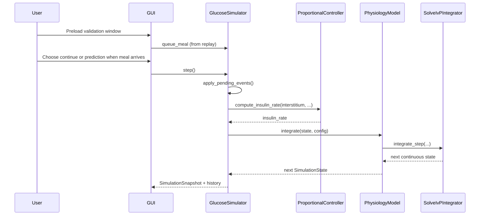
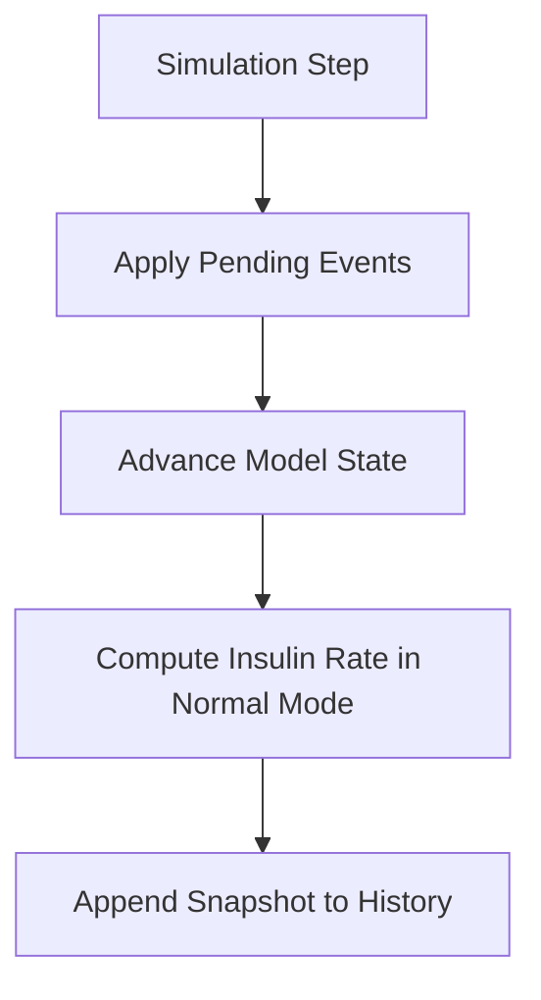

# Digital Twin Simulation Summary

## 1. Purpose of the Simulation Model
The simulation coordinates user disturbances, measurement assimilation,
control decisions, and physiology prediction in a deterministic step
loop. It provides a reproducible runtime for studying glucose-insulin
behavior and control responses under meal events.

Primary goals:
- Execute a deterministic update pipeline every step
- Provide live state/history for visualization
- Support interactive what-if scenarios through GUI controls

## 2. Expected Results and Use of Results
Expected outputs:
- Time traces of glucose, insulin, and insulin infusion rate
- Observable response to meals (glucose rise)
- Automated controller compensation after disturbances
- Moderate single-meal excursions that remain below the hard glucose
  clamp under the current tuned defaults

Typical use:
- Demonstration of closed-loop behavior
- Parameter tuning and qualitative sensitivity exploration
- Regression testing of control and model behavior

## 3. Exactness
- Numerical exactness: governed by `solve_ivp` method/tolerances from
  `IntegratorConfig`
- Model exactness: low-order approximation; suitable for education and
  engineering iteration, not medical diagnosis
- Determinism: high, given same initial conditions, events, and
  configuration

## 4. Time Requirements
- Current mode: near real-time stepping (GUI schedules repeated calls)
- Supports conceptual fast-forward by invoking multiple steps quickly
- Slow-motion is possible by increasing UI update interval externally
- Not implemented yet: explicit replay clock control or variable-rate
  scheduler API

## 5. Interactions with Other Entities
Current interactions:
- Humans: GUI user preloads GlucoBench windows and controls run/pause
  and reset. Meal decisions are made via a modal prompt when meal events
  arrive.
- Validation users: GUI can preload GlucoBench windows (user/start/end)
  and replay carbohydrate events against the benchmark trace while the
  plot overlays the recorded measurements
- Machines/Libraries: SciPy ODE solver (`solve_ivp`), plotting/UI stack,
  EKF-based estimator scaffold
- Databases/Sensors/Protocols: not connected in V1

## 6. Model Interfaces

### Internal interfaces (sub-model integration)
- `GlucoseSimulator` -> `ExtendedKalmanFilterEstimator`:
  `predict(dt_minutes, control_input)` and `update(measured_interstitium)`
  for interstitial glucose correction.
- `GlucoseSimulator` -> `ProportionalController`:
  `compute_insulin_rate(glucose, current_rate, config)` — **Note**: The
  `glucose` parameter receives the corrected interstitial estimate, not
  plasma glucose.
- `ExtendedKalmanFilterEstimator` -> `PhysiologyModel`:
  `integrate(state, model_config)` for process-model propagation.
- `PhysiologyModel` -> `SolveIvPIntegrator`:
  `integrate_step(derivative, y0, t0, dt, config)`

### External interfaces
- GUI to simulation commands:
  - Queue meal: `queue_meal(carbs)` (from replayed benchmark events)
  - Runtime controls: step/reset (and loop start/stop in GUI layer)
  - Meal decision prompt:
    - Continue simulation immediately or launch a prediction overlay
  - Validation preload controls:
    - Select user and inclusive start/end timestamp window
    - Preload actual glucose and carbohydrate references
    - Run replay through the same non-blocking Tk loop
- History output for plotting:
  `get_history_arrays()`

## 7. Simulation Parameters and Controls

### Configurable parameters
- Model dynamics and safety bounds (`ModelConfig`)
- Controller tuning and safety (`ControllerConfig`)
- Solver behavior (`IntegratorConfig`)
- Initial state (`SimulationState`)

### Runtime controls (implemented)
- Start: handled by GUI scheduling loop
- Stop/Pause: handled by GUI stop of scheduling loop
- Step: `GlucoseSimulator.step()`
- Reset to initial conditions: `GlucoseSimulator.reset()`
- Validation mode:
  - Seeds initial simulated glucose from first selected actual value
  - Replays carbohydrate events as queued meal events
  - Runs the physiology model directly without feeding benchmark glucose
    back into the plotted state
  - Keeps dataset insulin logs available as historical therapy context
    for replay diagnostics, without treating them as future data
  - Can optionally apply historical insulin therapy step-by-step as an
    exogenous replay input when comparing therapy-aware runs
  - Auto-stops at selected end timestamp span
  - Pauses when a meal arrives to allow continue vs. prediction
  - Prediction runs ahead without ingesting new benchmark data and
    leaves a background overlay on the plot

### Current model shape
- Meals are absorbed through a delayed internal pathway rather than
  entering glucose instantly.
- Insulin action is also delayed so the model reacts more gradually to
  glucose excursions and replayed therapy.

### Not implemented in V1
- Save/load simulation snapshots
- Replay/rewind timeline controls

The validation replay path keeps the benchmark glucose series as plot
context only and advances the simulated trace passively. That keeps the
GUI line smooth and prevents the replay from snapping to measurement
noise. If present, insulin therapy rows are retained as replay metadata
so they can later be interpreted as causal therapy inputs or diagnostic
traces, but they do not replace the simulated insulin state.
Therapy-aware replay is optional and exists for comparison; passive
validation remains the benchmark baseline for model fit.

## 8. Simulation Engine
Engine characteristics:
- Deterministic step order:
  1. Apply pending user events
  2. Advance the model state over one step
  3. Compute controller insulin rate from the corrected estimate in
     normal mode
  4. Store the resulting state in history
- Validation orchestration keeps the same deterministic event timing by
  queuing due carbs before each `step()` call in the GUI loop.
- Solver: `scipy.integrate.solve_ivp` (RK45/DOP853/BDF supported)
- Time step: fixed logical step width `dt_minutes` per simulator step
- Zero-crossing/event functions: possible via `IntegratorConfig.events`,
  currently optional and typically unused

State and output vectors (conceptual form):

$$
\mathbf{x}_k =
\begin{bmatrix}
G_k \\
I_k \\
C_k \\
G_{\mathrm{int},k}
\end{bmatrix},
\qquad
\mathbf{y}_k =
\begin{bmatrix}
t_k \\
G_k \\
I_k \\
G_{\mathrm{int},k} \\
u_{I,k}
\end{bmatrix}
$$

## 9. Record / Replay / Rewind
- Record: implemented via accumulated `SimulationSnapshot` history
- Replay: not implemented as a dedicated playback subsystem
- Rewind: not implemented; nearest equivalent is full `reset()`

## 10. Practical Constraints
- Event buffering is step-based; intra-step event timing is not modeled
- Benchmark meals during prediction are ignored by the simulation
- Real-time guarantees depend on GUI scheduling and host performance
