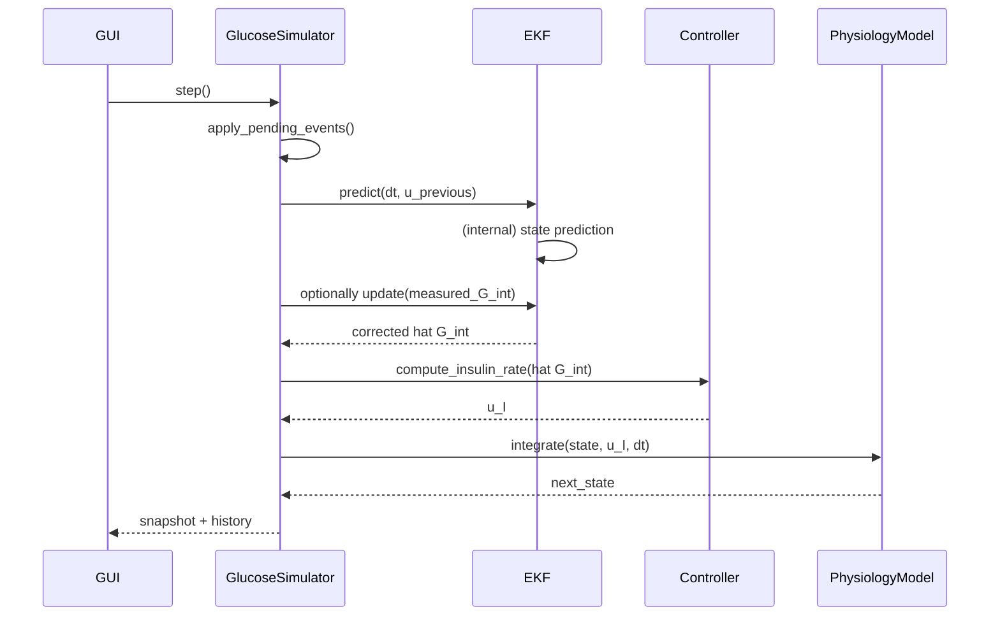

# Digital Twin Simulation Summary

## 1. Purpose

The simulator provides a deterministic runtime that coordinates user
events, estimator corrections, control computation, and physiology
integration. Its primary role is to power the GUI-driven validation and
what‑if workflows: replay benchmark CGM windows, run conservative short
horizon forecasts, and produce reproducible artifacts for offline
analysis.

Goals:
- Run replay and prediction scenarios deterministically.
- Provide history and diagnostics for visualization and validation.
- Keep safety and conservatism at the controller boundary.

## 2. High-level behaviour and outputs

Typical outputs available each step or via history access:
- Time series: plasma glucose, interstitial glucose, plasma insulin,
  insulin infusion command, basal-rate trace, subcutaneous depot.
- Validation artifacts: JSONL replay logs, CSV summaries, PNG plots.
- Metrics: RMSE, MAE, MARD, peak-time error and simple oscillation
  counts for replay/prediction comparison.

Typical uses:
- Validation against GlucoBench windows.
- Rapid controller sensitivity exploration.
- Developer regression testing and reproducible scenario generation.

## 3. Deterministic step loop (engine)

The simulator executes a fixed logical step each tick (`dt_minutes`):

1. Apply pending user events (meals, boluses, basal samples).
2. EKF predict step (process propagation) using previous control.
3. EKF update step (ingest measurement when in replay mode).
4. Compute controller output using corrected interstitial estimate.
5. Integrate physiology forward (call `solve_ivp` over step interval).
6. Store snapshot in history and optional replay log.

This deterministic order simplifies reproducibility and testing.

## 4. Modes: Replay vs Prediction

- Replay / Inference: measurement ingestion enabled; estimator
  corrections are applied so that simulated interstitial glucose aligns
  with recorded CGM for validation. Controller may be disabled for pure
  inference runs. Replay mode produces comparison metrics against the
  benchmark.
- Prediction / What‑If: open-loop forecast where the simulator does not
  ingest further benchmark measurements. Planned meals/boluses are
  applied before integration and the run returns a conservative forecast
  overlay.

## 5. Interfaces (internal & external)

Internal (typical method signatures):
- `GlucoseSimulator.step(use_controller: bool = True) -> SimulationSnapshot`
- `ExtendedKalmanFilterEstimator.predict_with_details(dt_minutes, control_input)`
- `ProportionalController.compute_insulin_rate(glucose_estimate, current_rate)`
- `PhysiologyModel.integrate(state, model_config, dt_minutes)`

External (GUI / scripts):
- `queue_meal(carbs: float)` — schedule a meal event.
- `queue_bolus(units: float)` — schedule a bolus into subcutaneous depot.
- `set_basal_rate(units_per_hour: float)` — set persistent basal.
- `get_history_arrays()` — retrieve recorded arrays for plotting.

## 6. Validation artifacts and metrics

Validation runs generate:
- JSONL replay logs (timestamped snapshots with inputs/outputs).
- CSV summary with RMSE/MAE/MARD and event-aligned peak-time error.
- PNG diagnostic plots for visual inspection.

Metrics computed against reference CGM series include:
- RMSE: $\sqrt{\frac{1}{N}\sum (\hat G_{int} - G_{ref})^2}$
- MAE: $\frac{1}{N}\sum |\hat G_{int} - G_{ref}|$
- MARD: mean absolute relative deviation (percent)

## 7. Configurables and runtime controls

Configs:
- `ModelConfig`: dynamics, safety clamps, unit mappings.
- `ControllerConfig`: $K_p$, deadband, bounds, rate limiter.
- `IntegratorConfig`: solver selection and tolerances.
- `SimulationState`: initial conditions and runtime flags.

Runtime controls exposed in the GUI and usable from scripts:
- Start / Stop (non-blocking GUI scheduling loop).
- Step / Reset.
- Speed slider (adjusts GUI tick rate; supports accelerated stepping).
- Validation mode toggles (seed initial value, ingest measurements).

## 8. Practical constraints and implementation notes

- Event timing is quantized to the simulator step width; intra-step
  timing is not modelled.
- The prediction path ignores incoming benchmark measurements by
  design — predictions are intentionally conservative open-loop runs.
- Real-time behaviour depends on host performance and GUI scheduling.
- JSONL replay logs capture sufficient metadata to reproduce a run
  offline (mode, bolus assumptions, estimator tuning).

## 9. Extensibility and testing

- The deterministic step order is intentionally simple to facilitate
  unit testing and reproducible validation artifacts.
- To add more complex event timing, extend the event subsystem to
  support sub-step interpolation and continuous event application.

---

Last updated: 2026-05-16
