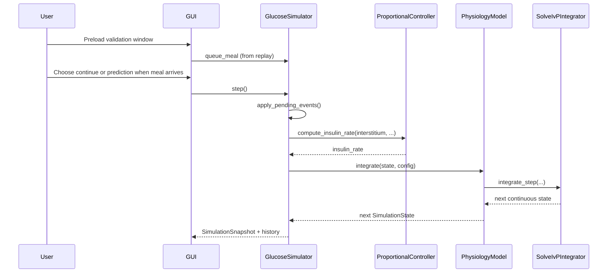
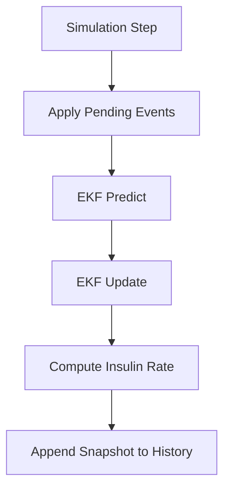

# Digital Twin Simulation Summary

## 1. Purpose of the Simulation Model
The simulation coordinates user disturbances, measurement assimilation,
control decisions, and physiology prediction in a deterministic step
loop. It provides a reproducible runtime for studying glucose-insulin
behavior and control responses under meal events and validation replay
windows.

Primary goals:
- Execute a deterministic update pipeline every step
- Reproduce recorded CGM traces during replay and validation runs
- Provide live state/history for visualization
- Support conservative interactive what-if scenarios through GUI controls

## 2. Expected Results and Use of Results
Expected outputs:
- Time traces of glucose, insulin, and insulin infusion rate
- Observable response to meals or bolus inputs when replayed or
  simulated conservatively
- Automated controller compensation after disturbances
- Validation replay traces that overlay measured CGM data and report
  RMSE, MAE, and oscillation counts
- Moderate scenario responses that stay interpretable and do not rely on
  aggressive physiological assumptions

Typical use:
- Demonstration of closed-loop behavior
- Parameter tuning and qualitative sensitivity exploration
- Regression testing of control and model behavior

## 3. Exactness
- Numerical exactness: governed by `solve_ivp` method/tolerances from
  `IntegratorConfig`
- Model exactness: low-order approximation; suitable for replay,
  validation, and engineering iteration, not medical diagnosis
- Determinism: high, given same initial conditions, events, and
  configuration

## 4. Time Requirements
- Current mode: near real-time stepping (GUI schedules repeated calls)
- Supports conceptual fast-forward by invoking multiple steps quickly
- Slow-motion is possible by increasing UI update interval externally
- Not implemented yet: explicit replay clock control or variable-rate
  scheduler API

## 5. Interactions with Other Entities
Current interactions:
- Humans: GUI user preloads GlucoBench windows and controls run/pause
  and reset. Meal decisions are made via a modal prompt when meal events
  arrive.
- Validation users: GUI can preload GlucoBench windows (user/start/end)
  and replay carbohydrate events plus glucose measurements from dataset
  timestamps. The validation workflow also writes a CSV summary and PNG
  plots for each selected window.
  The GUI now also writes a JSONL replay log per window under
  `project_files/phase1_results/validation_logs/` containing simulated
  plasma glucose, interstitium, insulin, and the matched measured CGM and
  event values for later analysis.
- Machines/Libraries: SciPy ODE solver (`solve_ivp`), plotting/UI stack,
  EKF-based estimator scaffold
- Databases/Sensors/Protocols: not connected in V1

## 6. Model Interfaces

### Internal interfaces (sub-model integration)
- `GlucoseSimulator` -> `ExtendedKalmanFilterEstimator`:
  `predict_with_details(dt_minutes, control_input)` and
  `update(measured_interstitium)` for interstitial glucose correction.
- `GlucoseSimulator` -> `ProportionalController`:
  `compute_insulin_rate(glucose, current_rate, config)` — **Note**: The
  `glucose` parameter receives the corrected interstitial estimate, not
  plasma glucose.
- `ExtendedKalmanFilterEstimator` -> `PhysiologyModel`:
  `integrate(state, model_config)` for process-model propagation.
- `PhysiologyModel` -> `SolveIvPIntegrator`:
  `integrate_step(derivative, y0, t0, dt, config)`

### External interfaces
- GUI to simulation commands:
  - Queue meal: `queue_meal(carbs)` (from replayed benchmark events)
  - Runtime controls: step/reset (and loop start/stop in GUI layer)
  - Meal decision prompt:
    - Continue simulation immediately or launch a prediction overlay
  - Validation preload controls:
    - Select user and inclusive start/end timestamp window
    - Preload actual glucose and carbohydrate references
    - Run replay through the same non-blocking Tk loop
- History output for plotting:
  `get_history_arrays()`

## 7. Simulation Parameters and Controls

### Configurable parameters
- Model dynamics and safety bounds (`ModelConfig`)
- Controller tuning and safety (`ControllerConfig`)
- Solver behavior (`IntegratorConfig`)
- Initial state (`SimulationState`)

### Runtime controls (implemented)
- Start: handled by GUI scheduling loop
- Stop/Pause: handled by GUI stop of scheduling loop
- Step: `GlucoseSimulator.step()`
- Reset to initial conditions: `GlucoseSimulator.reset()`
- Speed slider: adjusts GUI tick rate (steps/sec); max speed is 1 ms/step
- Validation mode:
  - Seeds initial simulated glucose from first selected actual value
  - Replays carbohydrate events as queued meal events
  - Replays recorded insulin bolus events as queued bolus events
  - Feeds the window glucose series into the estimator as a measurement
    reference
  - Auto-stops at selected end timestamp span
  - Pauses when a meal arrives to allow continue vs. prediction
  - Prediction runs ahead without ingesting new benchmark data and
    leaves a background overlay on the plot
  - Writes a structured JSONL replay log for the full validation run so
    simulated and measured values can be reloaded later without rerunning
    the GUI session

### Not implemented in V1
- Save/load simulation snapshots
- Replay/rewind timeline controls

The validation replay path treats benchmark glucose values as
measurement inputs for the estimator and overlays the same reference in
the plot. It does not overwrite the simulated glucose state directly.

The prediction path is intentionally conservative: it is meant to show a
short horizon trend after an event, not to claim that the simulator can
reconstruct full meal physiology.

## 8. Simulation Engine
Engine characteristics:
- Deterministic step order:
  1. Apply pending user events
  2. Propagate the EKF prediction using the previous control input
  3. Correct the estimate with the current measurement reference
  4. Compute controller insulin rate from the corrected estimate
  5. Store the corrected estimate in history
- Validation orchestration keeps the same deterministic order by queuing
  due carbs and due measurements before each `step()` call in the GUI
  loop.
- Solver: `scipy.integrate.solve_ivp` (RK45/DOP853/BDF supported)
- Time step: fixed logical step width `dt_minutes` per simulator step
- Zero-crossing/event functions: possible via `IntegratorConfig.events`,
  currently optional and typically unused

State and output vectors (conceptual form):

$$
\mathbf{x}_k =
\begin{bmatrix}
G_k \\
I_k \\
 C_{\mathrm{stomach},k} \\
 C_{\mathrm{intestine},k} \\
G_{\mathrm{int},k}
\end{bmatrix},
\qquad
\mathbf{y}_k =
\begin{bmatrix}
t_k \\
G_k \\
I_k \\
G_{\mathrm{int},k} \\
u_{I,k}
\end{bmatrix}
$$

## 9. Record / Replay / Rewind
- Record: implemented via accumulated `SimulationSnapshot` history
- Replay: not implemented as a dedicated playback subsystem
- Rewind: not implemented; nearest equivalent is full `reset()`

## 10. Practical Constraints
- Event buffering is step-based; intra-step event timing is not modeled
- Benchmark meals during prediction are ignored by the simulation
- Real-time guarantees depend on GUI scheduling and host performance
- Bolus inputs should be interpreted as replayed scenario signals unless
  the user has explicitly calibrated them to the model's internal units

## 11. Replay vs Prediction (Inference / What‑If)

The simulator supports two complementary workflows that are important
for validation and for prospective what‑if forecasting:

- Replay / Inference: controller actions are disabled and the EKF is
  used to infer latent insulin dynamics from measured interstitial
  glucose. This mode is intended for post-hoc reconstruction of
  insulin with documented estimator tuning and optional offline
  smoothing. The GUI overlays the RTS smoothed insulin trace after
  replay completion.
- Prediction / What‑If: used when simulating a future scenario (for
  example after a queued meal). Predictions run open‑loop: they accept
  an explicit bolus event (recorded or calculated) applied before the
  model propagation and do not ingest further benchmark measurements.

Validation note:
- Phase 1 validation currently uses tuned meal absorption defaults
  (`stomach_tau_minutes=18.0`, `intestine_tau_minutes=40.0`) and a
  faster interstitial time constant (`interstitium_tau_minutes=8.0`).
  These settings improved the replay metrics compared with the original
  baseline.

Implementation notes:

- `GlucoseSimulator.step()` may be called with `use_controller=False`
  to run replay/inference.
- A discrete `queue_bolus()` event is available to model an
  administrated insulin bolus for prediction runs; boluses are applied
  before EKF prediction so the estimator and model see the input.
- All prediction/replay runs should include snapshot metadata (mode,
  bolus assumptions, estimator tuning) for reproducibility.

Update requirement: keep this section aligned with the `Simulator` and
`Estimator` docstrings when further refactors are made.
